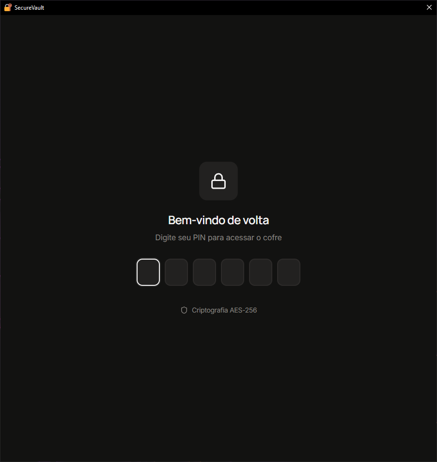
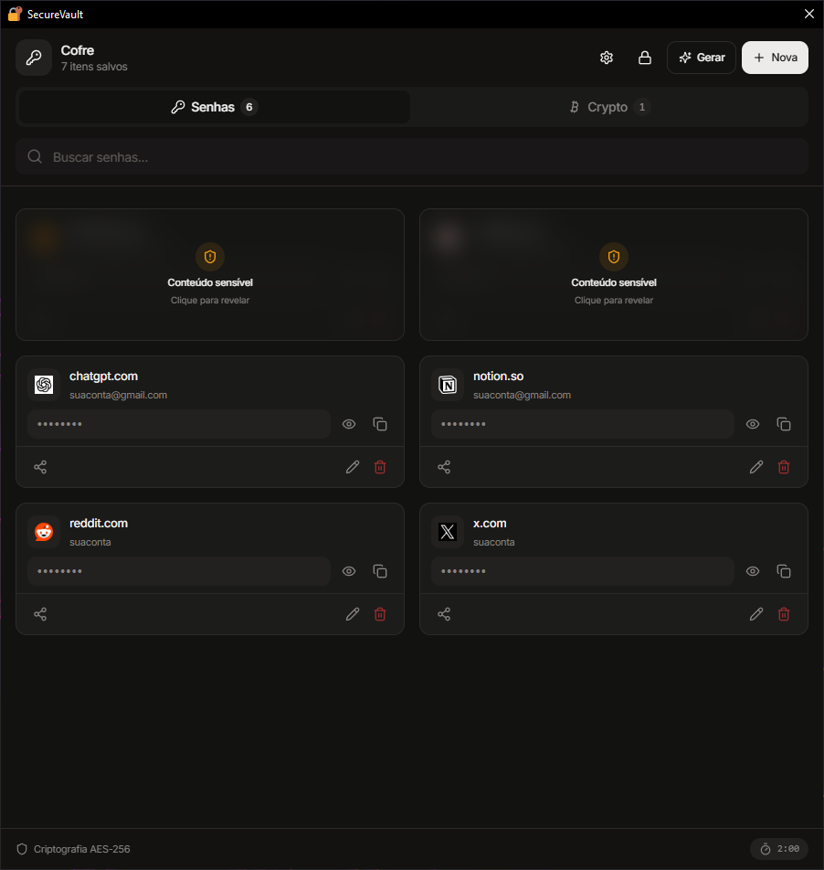
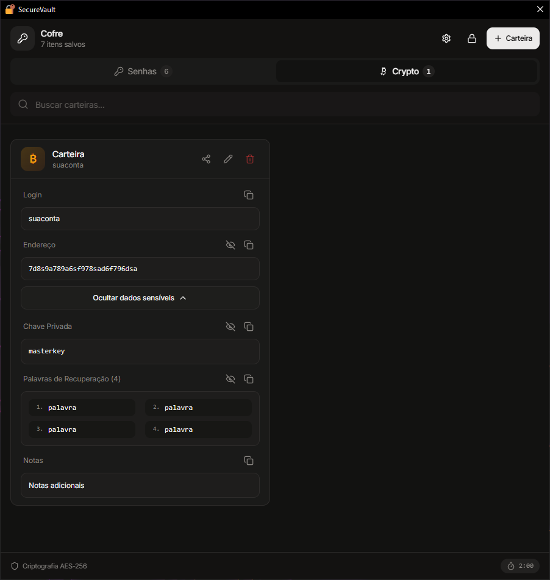
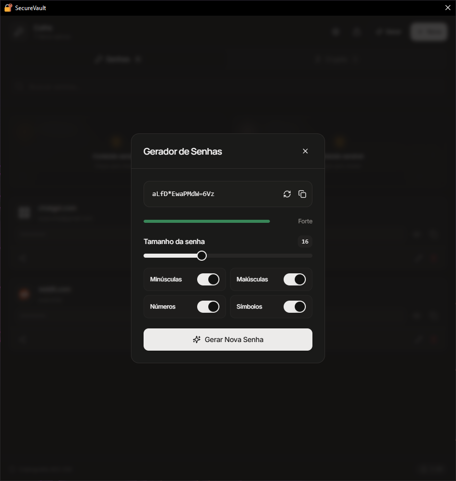
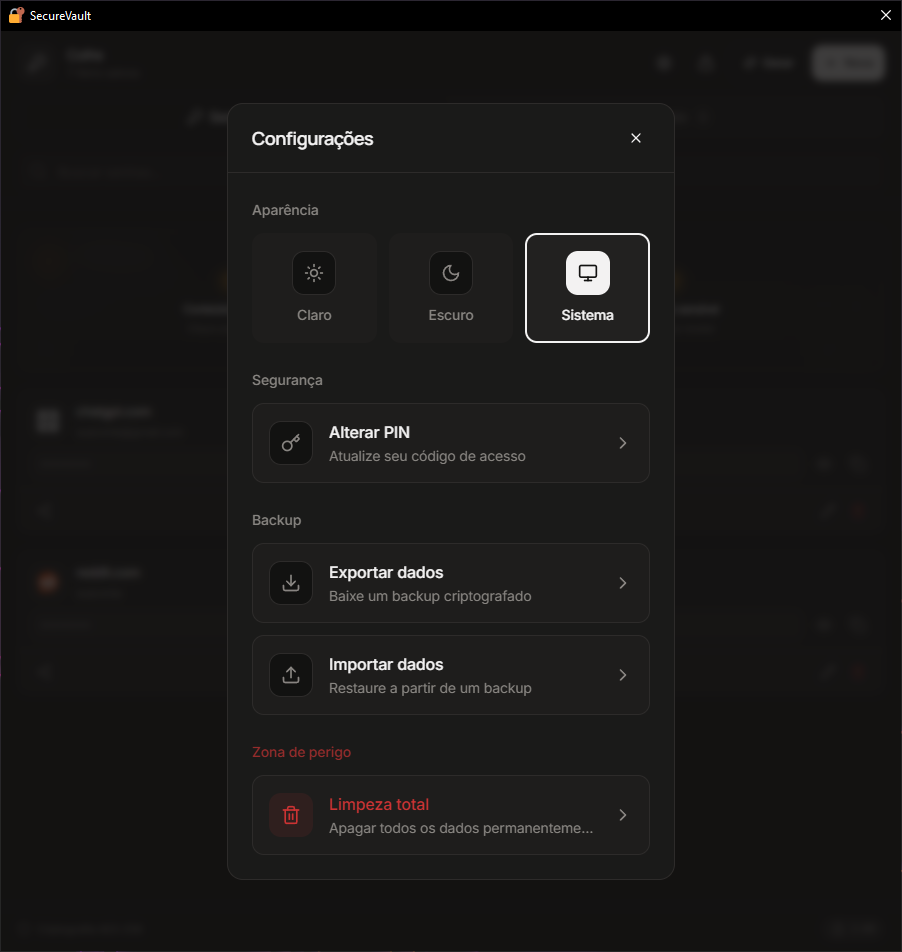

<div align="center">

# 🛡️ SecureVault

### O seu cofre digital. Offline, seguro e minimalista.


<br>

[Sobre](#-sobre) • [Galeria](#-galeria-visual) • [Funcionalidades](#-funcionalidades) • [Instalação](#-instalação)

</div>

---

## 📋 Sobre

O **SecureVault** redefine o gerenciamento de credenciais com foco total em **privacidade**.

Diferente de soluções em nuvem, o SecureVault opera sob o princípio _Local-First_. Seus dados são criptografados com padrões militares (AES-256) e armazenados em um banco de dados SQLite local. Nenhuma senha, chave privada ou nota sai do seu dispositivo.

> **Filosofia:** "Seus dados, seu dispositivo, suas regras."

---

## 📸 Galeria Visual

<div align="center">

### 1. Acesso Seguro

Proteção via PIN, criptografia no boot e bloqueio automático.



<br><br>

### 2. Dashboard

Visão geral limpa de todas as suas credenciais.



<br><br>

### 3. Carteira Cripto

Cold storage digital para Seeds, Chaves Privadas e Endereços.



<br><br>

### 4. Gerador de Senhas

Criação de senhas com alta entropia e feedback visual.



<br><br>

### 5. Configurações

Personalização de temas, backup e zona de perigo.



</div>

---

## ✨ Funcionalidades

### 🔐 Segurança Hardcore

- **Criptografia Militar:** AES-256-GCM para todos os dados sensíveis.
- **Auto-Lock Inteligente:** Bloqueio automático após 2 minutos de inatividade.
- **Wipe Automático:** Apaga os dados locais após 5 tentativas incorretas de PIN.
- **Proteção de Memória:** Limpeza automática da área de transferência.

### 🚀 Produtividade

- **Gerenciador de Senhas:** Organize logins, notas e dados bancários.
- **Crypto Wallet:** Suporte multi-rede para Bitcoin, Ethereum, Solana, etc.
- **Backup e Portabilidade:** Exportação e importação segura em JSON.
- **Verificação de Vazamentos:** Integração segura com _Have I Been Pwned_.

---

## 🛠️ Stack Tecnológica

<div align="center">

|       Core       |   Frontend   |        UI        |
| :--------------: | :----------: | :--------------: |
| **Tauri (Rust)** | **React 18** | **Tailwind CSS** |
|      SQLite      |  TypeScript  |    Shadcn/UI     |
|     AES-256      |     Vite     |  Framer Motion   |

</div>

---

## 🚀 Instalação e Uso

1.  Baixe a versão mais recente na aba [**Releases**](https://github.com/seu-usuario/securevault/releases).
2.  Execute o instalador `SecureVault-Setup.exe`.
3.  Defina seu **PIN mestre** e guarde as palavras de recuperação.

### Para Desenvolvedores

```bash
# Clone o repositório
git clone [https://github.com/seu-usuario/securevault.git](https://github.com/seu-usuario/securevault.git)

# Instale dependências
npm install

# Inicie o modo Dev
npm run tauri dev
```
